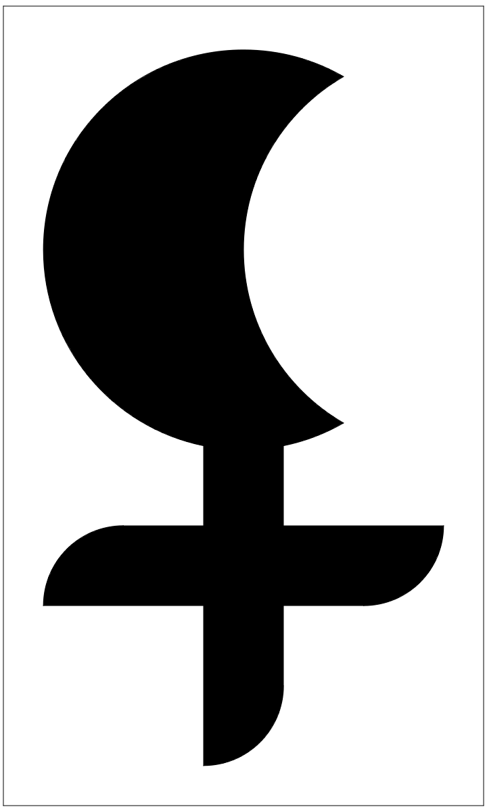

#&#8203;🧙 The Wizard 🧙

_A.k.a. Mage

##Name:

##Level:

##XP:

##Look:

##Alignment:

##Bonds

_Fill in at least one with the name of a companion, or write your own._

*

*

*

*

**(Write your own):**

##Race:

##Attribute Scores

_Assign these scores to your stats: 16 (+2), 15 (+1), 13 (+1), 12 (+0), 9 (+0), and 8 (-1)._

☐ (-1 – Weak) | **STR – Strength:**

☐ (-1 – Shaky) | **DEX – Dexterity:**

☐ (-1 – Sick) | **CON – Constitution:**

☐ (-1 – Stunned) | **İNT – İntelligence:**

☐ (-1 – Confused) | **WİS – Wisdom:**

☐ (-1 – Scarred) | **CHA – Charisma:**

##Combat Stats

**Armor (🛡️):**

**Max Hit Points (❤️; [___] + Constitution):**

**Current Hit Points (♡):**

**Damage: D[___]**

##Starting Moves

*

*

*

*

*

##Advanced Moves (Levels 02 To 10)

_When you gain a level from 02-10, choose from these moves._

*

*

*

*

##Advanced Moves (Levels 06 To 10)

_When you gain a level from 06-10, choose from these moves._

*

*

*

*

*

##Starting Gear & Coins

**Coins (💰):**

**Max Load (🎒; [___] + Strength):**

**Current Load (⚖️):**

**Possessions:**

  * Some **unique token**.
   Describe it:

  * **Weapon 1:**

  * **Weapon 2:**

  * **Armo(u)r:**

  Other possessions (Write down here):

  *

  *

  *

  *

  *

  *

  *

  *

  *

  *

##Cantrips

_You prepare all of your cantrips every time you Prepare Spells without having to select them or count them toward your allotment of spells._

☐**Light:** An item you touch glows with arcane light, about as bright as a torch. It gives off no heat or sound and requires no fuel, but it is otherwise like a mundane torch. You have complete control of the color of the flame. The spell lasts as long as it is in your presence.

☐**Unseen Servant:** You conjure a simple invisible construct that can do nothing but carry items. It has Load 3 and carries anything you hand to it. It cannot pick up items on its own and can only carry those you give to it. Items carried by an unseen servant appear to float in the air a few paces behind you. An unseen servant that takes damage or leaves your presence is immediately dispelled, dropping any items it carried.

☐**Prestidigitation:** You perform minor tricks of true magic. If you touch an item as part of the casting you can make cosmetic changes to it: clean it, soil it, cool it, warm it, flavor it, or change its color. If you cast the spell without touching an item you can instead create minor illusions no bigger than yourself. Prestidigitation illusions are crude and clearly illusions – they won’t fool anyone, but they might entertain them.

##1th Level Spells

☐**Contact Spirits (Summoning):** Name the spirit you wish to contact (or leave it to the GM). You pull that creature through the planes, just close enough to speak to you. It is bound to answer any one question you ask to the best of its ability.

☐**Detect Magic (Divination):** One of your senses is briefly attuned to magic. The GM will tell you what here is magical.

☐**Magic Missile (Evocation):** Projectiles of pure magic spring from your fingers. Deal 2d4 damage to one target.

☐**Charm Person (Enchantment – Ongoing):** The person (not beast or monster) you touch while casting this spell counts you as a friend until they take damage or you prove otherwise.

☐**Invisibility (Illusion – Ongoing):** Touch an ally: nobody can see them. They’re invisible! The spell persists until the target attacks or you dismiss the effect. While the spell is ongoing you can’t cast a spell.

☐**Telepathy (Divination – ongoing):** You form a telepathic bond with a single person you touch, enabling you to converse with that person through your thoughts. You can only have one telepathic bond at a time.

☐**Alarm:** Walk a wide circle as you cast this spell. Until you prepare spells again your magic will alert you if a creature crosses that circle. Even if you are asleep, the spell will shake you from your slumber.

##3th Level Spells

☐**:**

☐**:**

☐**Fireball (Evocation):** You evoke a mighty ball of flame that envelops your target and everyone nearby, inflicting 2d6 damage which ignores armor.

☐**:**

☐**:**

☐**:**

##5th Level Spells

☐**:**

☐**:**

☐**:**

☐**:**

##7th Level Spells

☐**:**

☐**:**

☐**:**

☐**:**

☐**:**

##9th Level Spells

☐**:**

☐**:**

☐**:**

☐**:**

☐**:**
